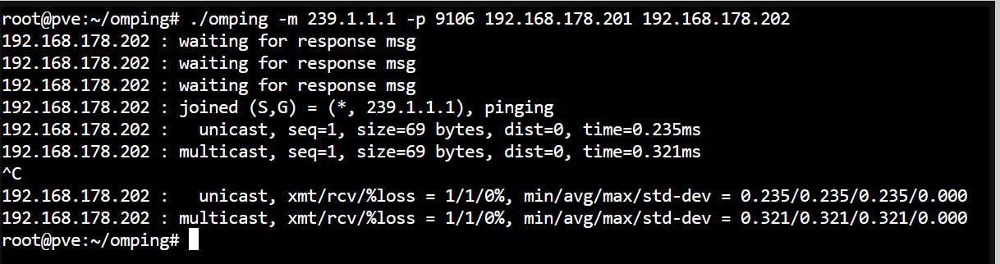
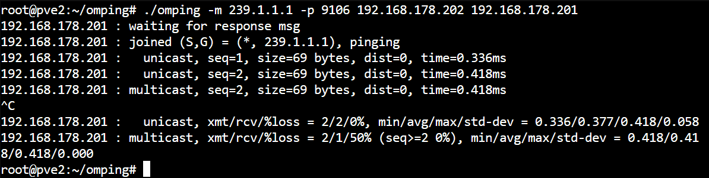

# Sources:
omping: https://www.ibm.com/docs/en/wip-mg/2.0.0?topic=membership-using-omping-test-multicast-connectivity

# Pre-requisites
## Testing for connectivity and latency.

### Standard Ping
We can do an inital sanity check by using ping to ensure that latency is below 5ms (recommmended latency as per Proxmox HA documentation)
`ping -c 100 -s 1024 IP_ADDR`

> [!NOTE]  
> While, ping is does measure latency in some capacity, it may not be fully reflective how much latency a node-to-node connection may have, especially for different types of traffic, and under different levels of load.


### Open Multicast ping (omping)
While, the omping tool is 5 years old and deprecated, we can still use it to guage some level of performance.

To install omping please look [here](https://github.com/troglobit/omping#installation)

If you are not on a RHEL/Oracle/Rocky Distribution, and can't build your own binary, you can use the pre-built omping binary [here](https://github.com/Wayrion/omping). Its built for x86 Debian.  

#### Usage
```bash
# Taken from the IBM Documentation linked at the top.
# On Server A.
omping -m <multicast or broadcast address> -p <cluster multicast discovery port> <IP of local cluster control interface> <cluster control IP address of Server B>

# On Server B
omping -m <multicast or broadcast address> -p <cluster multicast discovery port> <IP of local cluster control interface> <cluster control IP address of Server A>
```

```bash
# In my case the commands look like this
# 239.1.1.1 is just an arbitary IP for the multicast packets
# Server A (pve)
./omping -m 239.1.1.1 -p 9106 192.168.178.201 192.168.178.202
# Server B (pve2)
./omping -m 239.1.1.1 -p 9106 192.168.178.202 192.168.178.201
```




./omping -m 239.1.1.1 -p 9106 145.144.245.253 145.220.0.115

./omping -m 239.1.1.1 -p 9106 145.220.0.115 145.144.245.253


