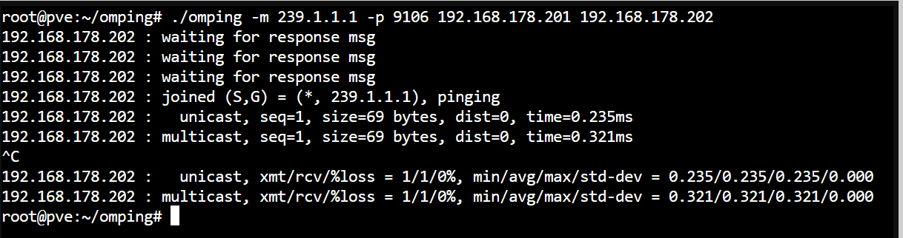
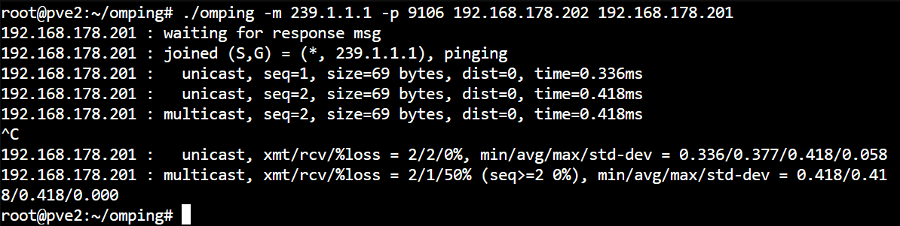
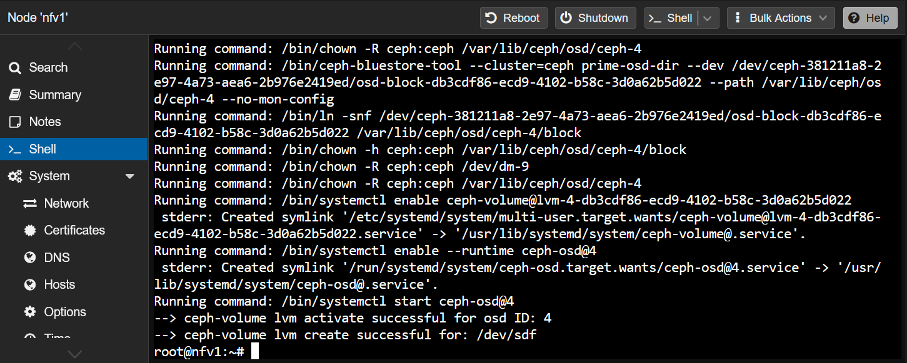
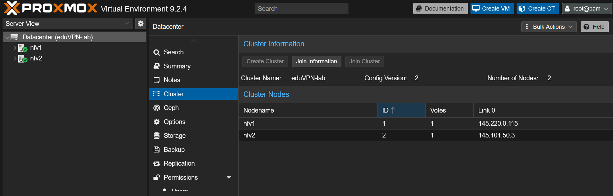
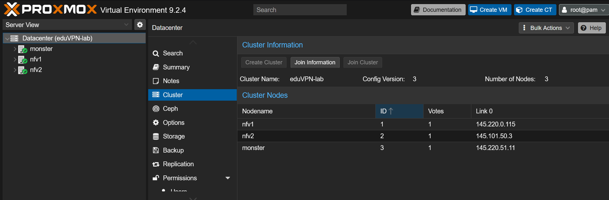
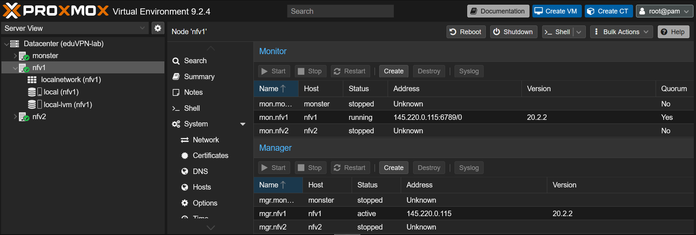
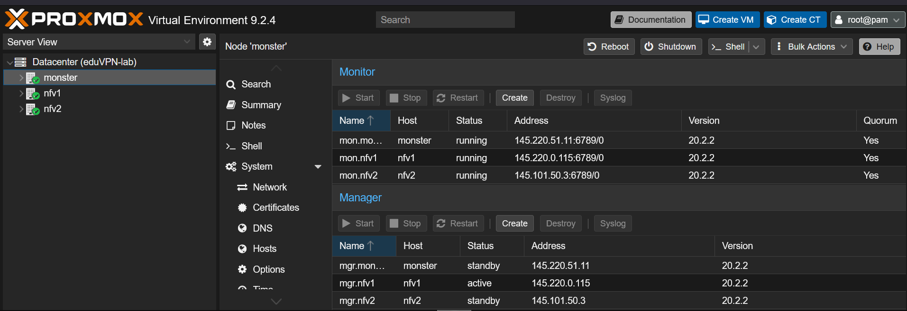
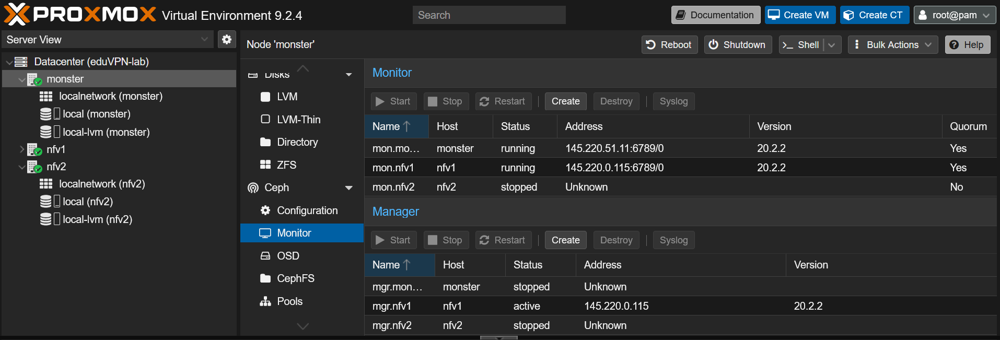

# Sources:
omping: https://www.ibm.com/docs/en/wip-mg/2.0.0?topic=membership-using-omping-test-multicast-connectivity

# Pre-requisites
## Testing for connectivity and latency.

### Standard Ping
We can do an inital sanity check by using ping to ensure that latency is below 5ms (recommmended latency as per Proxmox HA documentation)
`ping -c 100 -s 1024 IP_ADDR`

> [!NOTE]  
> While, ping is does measure latency in some capacity, it may not be fully reflective how much latency a node-to-node connection may have, especially for different types of traffic, and under different levels of load.


### Open Multicast ping (omping)
While, the omping tool is 5 years old and deprecated, we can still use it to guage some level of performance.

To install omping please look [here](https://github.com/troglobit/omping#installation)

If you are not on a RHEL/Oracle/Rocky Distribution, and can't build your own binary, you can use the pre-built omping binary [here](https://github.com/Wayrion/omping). Its built for x86 Debian.  

#### Usage
```bash
# Taken from the IBM Documentation linked at the top.
# On Server A.
omping -m <multicast or broadcast address> -p <cluster multicast discovery port> <IP of local cluster control interface> <cluster control IP address of Server B>

# On Server B
omping -m <multicast or broadcast address> -p <cluster multicast discovery port> <IP of local cluster control interface> <cluster control IP address of Server A>
```

```bash
# In my case the commands look like this
# 239.1.1.1 is just an arbitary IP for the multicast packets
# Server A (pve)
./omping -m 239.1.1.1 -p 9106 192.168.178.201 192.168.178.202
# Server B (pve2)
./omping -m 239.1.1.1 -p 9106 192.168.178.202 192.168.178.201
```



# Installation 

## Ceph
- Install Ceph by going to node > Ceph > Install Ceph > Start Tentacle (Code name of Ceph 20) Installation, choose No-Subscription if you don't have a subscription, if not Enterprise > y (when prompted to proceed with installation) > Next

- Configure your network here. For our deployment, we select the first Public Network IP/CIDR option from the drop down and set the cluster communication to also use the same network. If you wish, check the advanced box and you can configure the number of instances and replicas you want.

- Now this configuration can way based on the number of disks you have.


```bash
# Node 1:
root@nfv1:~# lsblk

NAME               MAJ:MIN RM   SIZE RO TYPE MOUNTPOINTS

sda                  8:0    0 447.1G  0 disk 

├─sda1               8:1    0  1007K  0 part 

├─sda2               8:2    0     1G  0 part /boot/efi

└─sda3               8:3    0 446.1G  0 part 

  ├─pve-swap       252:0    0     8G  0 lvm  [SWAP]

  ├─pve-root       252:2    0    96G  0 lvm  /

  ├─pve-data_tmeta 252:3    0   3.3G  0 lvm  

  │ └─pve-data     252:5    0 319.6G  0 lvm  

  └─pve-data_tdata 252:4    0 319.6G  0 lvm  

    └─pve-data     252:5    0 319.6G  0 lvm  

sdb                  8:16   0 447.1G  0 disk 

├─sdb1               8:17   0   512M  0 part 

└─sdb2               8:18   0 445.6G  0 part 

  └─vgroot-lvroot  252:1    0 445.6G  0 lvm  

sdc                  8:32   0 447.1G  0 disk 

├─sdc1               8:33   0  1007K  0 part 

├─sdc2               8:34   0     1G  0 part 

└─sdc3               8:35   0 446.1G  0 part 

sdd                  8:48   0 447.1G  0 disk 

├─sdd1               8:49   0  1007K  0 part 

├─sdd2               8:50   0     1G  0 part 

└─sdd3               8:51   0 446.1G  0 part 

sde                  8:64   0 447.1G  0 disk 

├─sde1               8:65   0  1007K  0 part 

├─sde2               8:66   0     1G  0 part 

└─sde3               8:67   0 446.1G  0 part 

sdf                  8:80   0 447.1G  0 disk 


# Node 2:
root@nfv2:~# lsblk

NAME               MAJ:MIN RM   SIZE RO TYPE MOUNTPOINTS

sda                  8:0    0 447.1G  0 disk 

├─sda1               8:1    0  1007K  0 part 

├─sda2               8:2    0     1G  0 part /boot/efi

└─sda3               8:3    0 446.1G  0 part 

  ├─pve-swap       252:0    0     8G  0 lvm  [SWAP]

  ├─pve-root       252:1    0    96G  0 lvm  /

  ├─pve-data_tmeta 252:2    0   3.3G  0 lvm  

  │ └─pve-data     252:4    0 319.6G  0 lvm  

  └─pve-data_tdata 252:3    0 319.6G  0 lvm  

    └─pve-data     252:4    0 319.6G  0 lvm  

sdb                  8:16   0 447.1G  0 disk 

sdc                  8:32   0 447.1G  0 disk 

sdd                  8:48   0 447.1G  0 disk 

sde                  8:64   0 447.1G  0 disk 

sdf                  8:80   0 447.1G  0 disk 


# Node 3:
root@monster:~# lsblk

NAME               MAJ:MIN RM  SIZE RO TYPE MOUNTPOINTS

sda                  8:0    0  2.2T  0 disk 

├─sda1               8:1    0 1007K  0 part 

├─sda2               8:2    0    1G  0 part /boot/efi

└─sda3               8:3    0  2.2T  0 part 

  ├─pve-swap       252:0    0    8G  0 lvm  [SWAP]

  ├─pve-root       252:1    0   96G  0 lvm  /

  ├─pve-data_tmeta 252:2    0 15.9G  0 lvm  

  │ └─pve-data     252:4    0    2T  0 lvm  

  └─pve-data_tdata 252:3    0    2T  0 lvm  

    └─pve-data     252:4    0    2T  0 lvm  

sdb                  8:16   0  1.7T  0 disk 

└─sdb1               8:17   0  1.7T  0 part 

sdc                  8:32   0  1.7T  0 disk 

└─sdc1               8:33   0  1.7T  0 part 

sdd                  8:48   1 14.3G  0 disk 

└─sdd1               8:49   1 14.3G  0 part 

sde                  8:64   0  512M  1 disk 

└─sde1               8:65   0  251M  1 part  
```

We are going to be using sdb through sdf on nodes 1 (nfv1) and  2 (nfv2), and sdb and sdc on node 3 (monster). This is because they are all SSDs and you can mix and match drives with CEPH.

Since we have 3 replicas, the total useable capacity is about 33%

So lets wipe the disks; paritions and signatures, and create an OSD.

to wipe the disks run the following command on nodes 1 and 2. On Node 3, we just run the commands for drives sdb and sdc.
```bash
wipefs -a -f /dev/sd{b,c,d,e,f}
sgdisk --zap-all /dev/sdb
sgdisk --zap-all /dev/sdc
sgdisk --zap-all /dev/sdd
sgdisk --zap-all /dev/sde
sgdisk --zap-all /dev/sdf
```

Now we can create the OSDs, 1 for each disk- this is the recommended approach unless you have disks larger than 30TB. For such cases please refer to the CEPH documentation.

Run the following command on Nodes 1 and 2, to create the OSDs for the drives. On Node 3, only run it for b and c. Just like the wipe commands.
```bash
for dev in b c d e f; do pveceph osd create /dev/sd$dev; done
```




Now go back to Node 1. Go to Datacenter -> Cluster -> Create Cluster -> Set a name (in our case eduVPN-lab) and add the networking devices. Close once it says TASK OK.

Now on the same page, click on Join information and save this so other nodes can join our cluster.

Now go to the other nodes -> click join cluster -> paste the join information in the box and enter the root password for node 1. At this point, the network may reset and you may get a connection error. Close the window for the task and refresh. If all goes well you should be able to see the other nodes as well. 



Now repeat this on node 3.



# Troubleshooting
## Ghost monitors and status stopped for the monitors and managers

Now if you're a choosen one like me, you might have some ghost monitors that are permanantly in the stopped status. Trying to start them doesn't work even though proxmox pretends like the start task succeeded. But when you try to delete them, you get "can't delete last monitor". 



https://forum.proxmox.com/threads/i-managed-to-create-a-ghost-ceph-monitor.58435/#post-269799


run the following commands according to 
https://forum.proxmox.com/threads/i-managed-to-create-a-ghost-ceph-monitor.58435/post-389798
```bash
# stop and disable and remove service
service ceph-mon@myhost stop
systemctl disable ceph-mon@myhost
systemctl daemon-reload
# delete the datadir of the monitor
rm -r /var/lib/ceph/mon/ceph-myhost
# Its fine if this command fails with No such file or dir


#adjust /etc/ceph/ceph.conf manually
# delete IP of stale monitor
mon_host = xx.0.99.83 xx.0.99.82 xx.0.99.84 
=> mon_host = xx.0.99.83 xx.0.99.82
# delete the section
[mon.myhost]
         public_addr = xx.0.99.84
```

```bash
# However, when I tried to run:
pveceph createmon
#  No active IP found for the requested ceph public network '145.220.0.115/24' on node 'monster' (500)
```

I had to fix this with the following:

```bash
ip addr show
# then copy the ip address of the active interface (like vmbr0)
```

now go to ceph conf
```bash
nano /etc/pve/ceph.conf
```

then make sure the IP address and the subnet configuration is correct under the global block

This is what it looks like for us, with an ip of 145.220.51.11/23, we are on the subnet 145.220.50.0/23
```bash
[global]
        auth_client_required = cephx
        auth_cluster_required = cephx
        auth_service_required = cephx
        fsid = 69cfc1ef-4199-42b2-ba21-f90305f86a2b
        mon_allow_pool_delete = true
        mon_host = 145.220.51.11 145.101.50.3
        ms_bind_ipv4 = true
        ms_bind_ipv6 = false
        osd_pool_default_min_size = 2
        osd_pool_default_size = 3
        public_network = 145.220.50.0/23, 145.220.0.0/24, 145.101.50.0/23
```

Its safe to remove cluster network as we are using the same network to sync osds


save with ctrl + s, then close with ctrl + x


now run 
```bash
pveceph mon create
```

if that complains because it tries to use the wrong IP address, pass an ip address manually with
```bash
pveceph mon create --mon-address 145.101.50.3
```

now restart all the services with
```
systemctl restart ceph-mon.target
systemctl restart ceph-osd.target
```

Finally, go back to Node -> Ceph -> Monitor. Now you should see all monitors running and have a valid IP address.

While you're here, delete the managers that aren't working and create new ones.


If everything works, it should look like this




Pray to the ceph and proxmox gods that it works and now go to Node -> Ceph -> Monitor and it should correctly show the monitor as running and with the correct IP and Quoroum set to yes.



Now repeat this painstaking process on the other nodes. I got lucky and Node 1 (nfv1) actually works fine (maybe because it was the node on which we created the cluster), so I just need to fix this on Node 2 (nfv2)


### Ceph auth stuff with keyring
ceph auth get-or-create client.bootstrap-osd mon 'allow profile bootstrap-osd' -o /etc/pve/priv/ceph.client.bootstrap-osd.keyring
  288  mkdir -p /var/lib/ceph/bootstrap-osd
  289  cp /etc/pve/priv/ceph.client.bootstrap-osd.keyring /var/lib/ceph/bootstrap-osd/ceph.keyring
  290  ceph-volume lvm create --data pve/ceph-osd


# VM Doesnt boot after migration
https://forum.proxmox.com/threads/volume-does-not-exist-error-after-vm-migration.127034/
