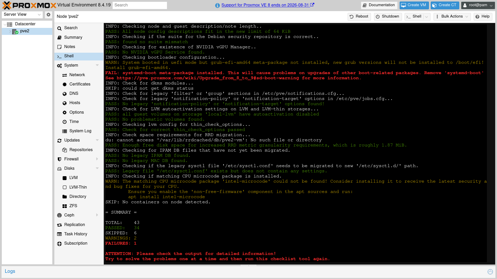
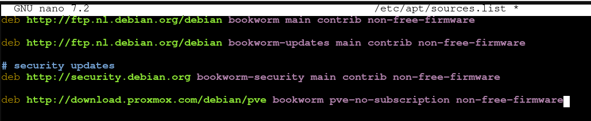

# Documentation: https://pve.proxmox.com/wiki/Upgrade_from_8_to_9

# Upgrade Strategy and Notes:
- Backup first
- Test backup
- Use a terminal multiplexer (like tmux) or kvm/ipmi
- Perform inplace backup via apt
- There's downtime associated with this migration.

# Prerequisites:
- Ensure you are atleast on a 8.4.1 or newer firmware. Also, run `sudo apt dist-upgrade` to upgrade to the latest available version on v8. This should be v8.4.19 or higher.

# Upgrade procedure:
- Run `sudo pve8to9 --full` to get a checklist of all the things to do before the upgrade.




- Run `sudo apt update` to update all packages to the latest version
- Update to the latest microcode.
    1. We need to enable non-free firmware. We can do this by:
    2. `sudo nano /etc/apt/sources.list`
    3. Add non-free-firmware to the end of the sources on EACH line.
    4. The final sources.list file should look something like this:

```bash
    deb http://deb.debian.org/debian bookworm main contrib non-free-firmware
    deb http://deb.debian.org/debian bookworm-updates main contrib non-free-firmware
    deb http://security.debian.org bookworm-security main contrib non-free-firmware
    ```

    

    5. Save and Exit (Ctrl + S then Ctrl + X)
    6. Run sudo apt update
    7. 
    - On AMD Systems (Most likely):
      `sudo apt install amd64-microcode`
      - On Intel Systems:
      `sudo apt install intel-microcode`
- Remove Systemd boot if the checklist prompts you to, using `sudo apt remove systemd-boot`
- At this step, it would be ideal to perform a reboot to ensure that the latest micro-code patch has been applied.
- Run `sudo apt dist-upgrade` to be on the latest minor version. Then hard refresh (Ctrl + Shift + R or ⌘ + Alt + R) the web UI to see the changes. Use `pveversion` to check your version. Ensure you are at least on version 8.4.1.
- Point apt to Debian 13 (Trixie) repositories with:
  ```bash
  sed -i 's/bookworm/trixie/g' /etc/apt/sources.list

  # ONLY if you use PVE Enterprise Repo:
  sed -i 's/bookworm/trixie/g' /etc/apt/sources.list.d/pve-enterprise.list
  ```

- Add the Proxmox V9 Package Repository using:
```bash
cat > /etc/apt/sources.list.d/proxmox.sources << EOF
Types: deb
URIs: http://download.proxmox.com/debian/pve
Suites: trixie
Components: pve-no-subscription
Signed-By: /usr/share/keyrings/proxmox-archive-keyring.gpg
EOF
```

- Now, we can take a note of all the running VMs, and save them to a list so we can start them later. Shutting down all VMs is a pre-requisite for the upgrade procedure. To take note of all the VMs running, `sudo qm list | awk '$3 == "running" {print $1}' > running_vms.txt`. Then proceed to shut them down (as root) using `for vm in $(cat /root/running_vms.txt); do sudo qm shutdown $vm; done`. Note that some VMs may fail to shut down as they do not interpret the shutdown signal from QEMU. You will need to stop these VMs manually.

- Now, we must take a backup of the running systems. If a backup task exists, run it now. If not see #Creating a Datastore and API Token for Proxmox Backup Server

- At this point we are almost done, and we must perform a final check with `pve8to9 --full` to see if all the items in the checklist have been completed.

- Ensure you're in the terminal multiplexer of your choice.

- We can finally run `sudo apt dist-upgrade` to start the official upgrade to v9. For any diffs opened in vim, firstly, do not panic and forget how to exit vim, then type q (or :q) to exit vim. For any splash screens asking for confirmation of changes, follow the guide listed in https://pve.proxmox.com/wiki/Upgrade_from_8_to_9#Update_Debian_Base_Repositories_to_Trixie, under the title, "Upgrade the system to Debian Trixie and Proxmox VE 9.0". Defaults are usually safe

- After dist-upgrade completes successfully, you can re-check using `pve8to9 --full` to ensure that the upgrade is successful.
- Optional but highly recommended, run `sudo apt modernize-sources` to migrate to the recommended deb822 style format.
- Reboot and check you are on the right version using `pveversion` and also perform a hard refresh on the browser as well (Ctrl + Shift + R or ⌘ + Alt + R).
- Restart the VMs again using `for vm in $(cat /root/running_vms.txt); do sudo qm start $vm; done`


# Creating a backup task
- If you do not already have a backup task set up, create one now:
  - In the Proxmox VE Web Interface, go to Datacenter -> Backup.
  - Click Add to create a new backup job.
  - Select the virtual machines or containers you wish to back up.
  - Configure the schedule (f.ex, run now or set a time).
  - Under Storage, select your Proxmox Backup Server storage.
  - Set mode to Snapshot (to backup the VMs without stopping them) or Stop (to perform a full backup by stopping the VM). Do not use suspend as its deprecated and superceeded by Snapshot.
  - Do not configure retention policies here, but rather in Proxmox Backup Server.
  - Confirm and create the job.
- Once the backup task is created (or if it already exists), run it now to back up your systems before proceeding with the upgrade.


# Creating a Datastore and API Token for Proxmox Backup Server [W.I.P]
- Create a datastore in Proxmox Backup Server (if it doesn't already exist):
  - Log into your Proxmox Backup Server web interface
  - Go to Datacenter -> Storage
  - Click Add -> Directory
  - Fill in the details:
    - ID: Choose a name for your datastore (e.g., `backups-store`)
    - Backing Path: The path where backups will be stored (e.g., `/mnt/datastore/backups-disk`)
    - Datastore Type: Select **Local**
    - **Prune**: Configure retention policy here (recommended)
  - Click **Add** to create the datastore
    - *Note: If a datastore with this ID already exists, you can skip this step*
- Create an API token for backups:
  - In the Proxmox Backup Server web interface, go to **Configuration** -> **Access Control** -> **API Tokens**
  - Click **Add**
  - Configure the token:
    - **User**: Select or create a user for backups (e.g., `root@pam`)
    - **Token Name**: A descriptive name (e.g., `pve-backup-token`)
    - **Expire**: Set an expiration date if desired (or leave blank for no expiration)
  - Click **Add**
  - **IMPORTANT**: Copy the generated token value immediately - you won't be able to see it again!

- Add Proxmox Backup Server storage to Proxmox VE:
  - Log into your Proxmox VE web interface
  - Go to **Datacenter** -> **Storage**
  - Click **Add** -> **Proxmox Backup Server**
  - Fill in the details:
    - **ID**: A name for this storage (e.g., `pbs-storage`)
    - **Server**: The IP address or hostname of your Proxmox Backup Server
    - **Username**: The user you created for backups (e.g., `backup@pbs`)
    - **Password**: Paste the API token you saved earlier
    - **Datastore**: Select the datastore you created
    - **Fingerprint**: 
      - Obtain the fingerprint from Proxmox Backup Server web interface under **Datacenter** -> **Summary**
  - Click **Add** to create the storage

- Add Permissions to the Storage and the token:
  - Go back to Proxmox Backup Server
  - Go to **DataStore** -> **[DataStore Name]** (e.g., `backups-store`) -> Permissions -> **Click Add**
  - Select the appropriate path, and then select the scoped API token for the backup task. Then grant it the  **DataStore.Admin** role.

- Configure backup job to use Proxmox Backup Server storage:
  - When creating or editing a backup job in Proxmox Virtual Environment (Datacenter -> Backup):
    - Under **Storage**, select the Proxmox Backup Server storage you just added
    - Configure other settings as needed (schedule, mode, etc.)
    - Remember: Configure retention policies in Proxmox Backup Server, not in the Proxmox Virtual Environment backup job

  - Incomplete: add information on how to backup the /etc/ folder
